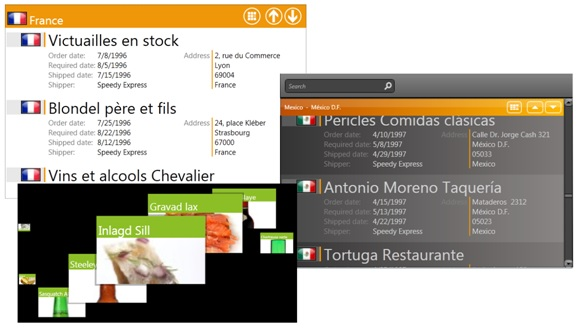

# Ultimate ListBox
_Only available in the Plus Edition_

Xceed's WPF listbox control is the perfect drop-in replacement for the standard listbox that behaves the way a listbox should! Thanks to an API that is designed to allow it to fit in to any project using the stock WPF listbox, you'll be up and running in no time. But this control gives you so much more than that standard control!

Xceed's WPF listbox delivers a background, remote data retrieval engine that only gets records currently visible in the viewport (data virtualization), or those immediately preceding or following the current ones (active/passive pre-fetching) so they are ready when the end-user scrolls. This greatly reduces the amount of data transferred, making remote data access feel fast like no other listbox can do. Background (asynchronous) retrieval keeps the UI responsive, always. What's more, everything works automatically!

Powerful grouping with sticky header support helps make data easy to handle, and an innovative group navigation control that provides previous/next group commands and index entry buttons lets end-users go quickly to the item they're looking for. A search box further assists end-users by giving them access to the filtering capabilities you define. And fluid smooth scrolling and insert/delete animations, which increase perceived performance by masking network lag when the listbox is waiting for slow data sources, help you create an incredible UI experience.

Xceed's listbox control also support multiple views: a traditional vertical-scrolling list, as well as a horizontal version, and "path" views, which let you place items along any geometric path in the viewport, for example, creating a carousel view. Beautiful themes let the listboxes match the style of your application, whatever it may be. And the listbox provides fully configurable drag-and-drop operations.

See the ListBox sample in the LiveExplorer application for examples.

## Properties
|| Property || Description
| AllowDrag | Gets or sets a value indicating whether the ListBox can be a drag source for purposes of drag-and-drop operations.  
| AnimationSettings | Gets or sets the animation settings of the ListBox.  
| ContainerConfigurations | Gets or sets the container configurations of the ListBox.  
| DisplayMemberPath | Gets or sets the name or path of the property that is displayed for each data item.  
| FilterExpression | Gets or sets the filter expression, which is embedded into the data query that is used to request data and filter the items that are displayed in a listbox.  
| GroupDescriptions | Gets a collection of group descriptions that describe how the items in a listbox are grouped.  
| HideDataNavigationPaneCommand | Gets the HideDataNavigation pane command.  
| HorizontalScrollBarVisibility | Gets or sets the visibility of the horizontal scroll bar.  
| ItemContainerStyle | Gets or sets the style that is used when rendering the item containers.  
| Items | Gets a list of the items (business objects) contained within the listbox, in the order in which they appear.  
| ItemScrollingBehavior | Gets or sets a value indicating how the data items in the grid are scrolled.  
| ItemsPanel | Gets or sets the template that defines the panel that controls the layout of items.  
| ItemsSource | Gets or sets the data source to which a listbox is bound.  
| ItemTemplate | Gets or sets the DataTemplate used to display each item.  
| NavigateToGroupCommand | Gets the navigate to group command.  
| NextViewCommand | Gets the next view command.  
| PreviousViewCommand | Gets the previous view command.  
| SelectedItem | Gets or sets the first item in the current selection or returns null if the selection is empty.  
| SelectedItems | Gets the list of currently selected items for the ListBox control.  
| SelectedRanges | Gets the ranges of items that are selected in a listbox.  
| SelectedValue | Gets or sets the value of the SelectedItem, obtained by using SelectedValuePath.
| SelectedValuePath | Gets or sets the path that is used to get the SelectedValue property of the SelectedItem property.
| SelectionMode | Gets or sets a value indicating how the items in a listbox are selected at run time.  
| ShowDataNavigationPaneCommand | Gets the show data navigation pane command.  
| SortDescriptions | Gets a collection of sort descriptions that describe how the items in a listbox are sorted.  
| ToolPaneVisibility | Gets or sets the visibility of the tool pane.  
| VerticalScrollBarVisibility | Gets or sets the visibility of the vertical scroll bar.  

## Events
|| Event || Description
| DragStarting | Raised when a drag operation is starting.  
| Filter | Raised for each item in the data source that has not already been excluded by a filter expression to determine if it passes a filter.  
| IDropTargetCanDropElement | Raised when a drag operation enters an IDropTarget.  
| IDropTargetDragEnter | Raised when a drag operation enters an IDropTarget.
| IDropTargetDragLeave | Raised when a drag operation leaves an IDropTarget.  
| IDropTargetDragOver | Raised when a drag operation hover over an IDropTarget.  
| IDropTargetDrop | Raised when a drag operation sucessfully drops on an IDropTarget.  
| PropertyChanged | Raised when the value of a property is changed.  
| SelectionChanged | Raised when the selection is changed.  

## Methods
|| Method || Description
| BeginGetSelectedItems | Begins the asynchronous retrieval of the selected items.  
| EndGetSelectedItems | Ends the asynchronous retrieval of the selected items.  
| GetContainerFromItem | Retrieves the container used to display the specified item.  
| GetParentListBox | Returns the parent ListBox of a ListBoxContainer.   
| OnApplyTemplate | Overridden. Builds the visual tree for the element.
| Refresh | Forces a refresh of the layout and configurations.  
| ScrollIntoView | Scrolls the specified item into view.  
| SelectAll | Selects all of the items in the ListBox.  
---