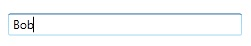

# WatermarkTextBox
Derives from Xceed.Wpf.Toolkit.AutoSelectTextBox

The WatermarkTextBox is simply a TextBox that allows you to specify an object, usually a String, to represent null or missing text.

## Using Text

{{
     <xctk:WatermarkTextBox Watermark="Enter First Name" />
}}

## Using an Image with Text

{{
         <xctk:WatermarkTextBox>
            <xctk:WatermarkTextBox.Watermark>
                <StackPanel Orientation="Horizontal">
                    <Image Source="Contact16.png" Stretch="None" />
                    <TextBlock Text="Enter First Name" Margin="4,0,0,0" />
                </StackPanel>
            </xctk:WatermarkTextBox.Watermark>
        </xctk:WatermarkTextBox>    
}}

## Custom WatermarkTemplate

{{
        <xctk:WatermarkTextBox Watermark="Enter First Name">
            <xctk:WatermarkTextBox.WatermarkTemplate>
                <DataTemplate>
                    <Border BorderBrush="Green" BorderThickness="1">
                        <ContentControl Content="{Binding}" Foreground="DarkRed" FontWeight="Bold" Focusable="False" />
                    </Border>
                </DataTemplate>
            </xctk:WatermarkTextBox.WatermarkTemplate>
        </xctk:WatermarkTextBox>   
}}

## Properties
|| Property || Description
| AutoMoveFocus | Gets or sets a value indicating if the focus can navigate in the appropriate flow direction (e.g., from one cell to another when a cell is being edited) when the cursor is at the beginning or end of the auto-select text box. (Inherited from AutoSelectTextBox)
| AutoSelectBehavior | Gets or sets a value indicating how the content of the auto-select text box is selected (Never or OnFocus). By default, Never. (Inherited from AutoSelectTextBox)
| KeepWatermarkOnGotFocus | Gets or sets if the **Watermark** will be displayed when the focus is set on the watermarkTextBox, when text is empty. Default is False.
| Watermark | Gets or sets the object to use in place of null or missing Text.
| WatermarkTemplate | Gets or sets the DataTemplate to use to display the **Watermark**.

**Support this project, check out the [Plus Edition](https://xceed.com/xceed-toolkit-plus-for-wpf/).**
---