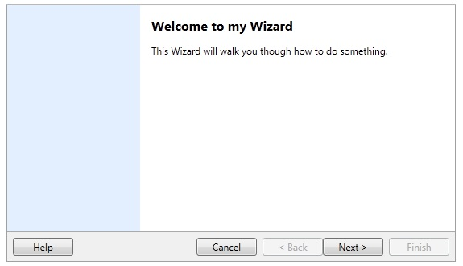

# Wizard
Derives from ItemsControl

Represents a wizard control that presents one or more [WizardPage](WizardPage) to assist the user in performing a task or series of tasks.

{{
        <xctk:Wizard FinishButtonClosesWindow="True">
            <xctk:WizardPage x:Name="IntroPage" 
                                   Title="Welcome to my Wizard"
                                   Description="This Wizard will walk you though how to do something." />
            <xctk:WizardPage x:Name="Page1" PageType="Interior"
                                   Title="Page 1"
                                   Description="This is the first page in the process."
                                   NextPage="{Binding ElementName=Page2}"
                                   PreviousPage="{Binding ElementName=IntroPage}"/>
            <xctk:WizardPage x:Name="Page2" PageType="Interior"
                                   Title="Page 2"
                                   Description="This is the second page in the process"/>
            <xctk:WizardPage x:Name="LastPage" PageType="Interior"
                                   Title="Last Page"
                                   Description="This is the last page in the process"
                                   CanFinish="True"/>
        </xctk:Wizard>
}}

## Properties
|| Property || Description
| BackButtonContent | Gets or sets the content of the wizard's Back button.
| BackButtonVisibility | Gets or sets the visibility of the Back button.
| CanCancel | Gets or sets a value indicating whether the Cancel button is enabled.
| CancelButtonClosesWindow | Gets or sets a value indicating whether the Cancel button closes the window.
| CancelButtonContent | Gets or sets the content of the Cancel button.
| CancelButtonVisibility | Gets or sets the visibility of the Cancel button.
| CanFinish | Gets or sets a value indicating whether the Finish button is enabled.
| CanHelp | Gets or sets a value indicating whether the Help button is enabled.
| CanSelectNextPage | Gets or sets a value indicating whether the Next Page button is enabled.
| CanSelectPreviousPage | Gets or sets a value indicating whether the Previous Page button is enabled.
| CurrentPage | Gets or sets the current page in the wizard.
| ExteriorPanelMinWidth | Gets or sets the minimum width of the exterior panel.
| FinishButtonClosesWindow | Gets or sets a value indicating whether the Finish button closes the containing window.
| FinishButtonContent | Gets or sets the content of the Finish button. 
| FinishButtonVisibility | Gets or sets the visibility of the Finish button.
| HelpButtonContent | Gets or sets the Help button content.
| HelpButtonVisibility | Gets or sets the visibility of the Help button.
| NextButtonContent |  Gets or sets the Next button content. 
| NextButtonVisibility | Gets or sets the visibility of the Next button.

## Events
|| Event || Description
| Cancel |  Raised when the wizard is canceled (the Cancel button is clicked).
| Finish | Raised when the Finish button is clicked.
| Help |  Raised when the Help button is pressed.
| Next | Raised when WizardCommands.NextPage command is executed.
| PageChanged | Raised when the current page changes.
| Previous | Raised when WizardCommands.PreviousPage command is executed.

**Support this project, check out the [Plus Edition](https://xceed.com/xceed-toolkit-plus-for-wpf/).**
---